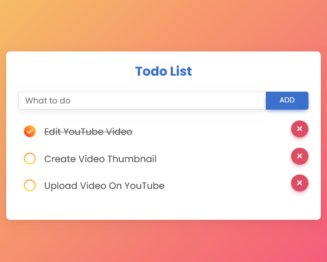

# To-Do List

A simple to-do list app built with JavaScript.

---

## Language Used

- HTML

- CSS

- JavaScript

---

## Preview

[See live demo](https://dev-shuvo.github.io/Todo-App-JavaScript/)

|  |
| ---------------- |

---

## Installation

Download the package as `ZIP` and edit the `HTML` and `CSS` as you like.

---

## License

[MIT](https://choosealicense.com/licenses/mit/)
